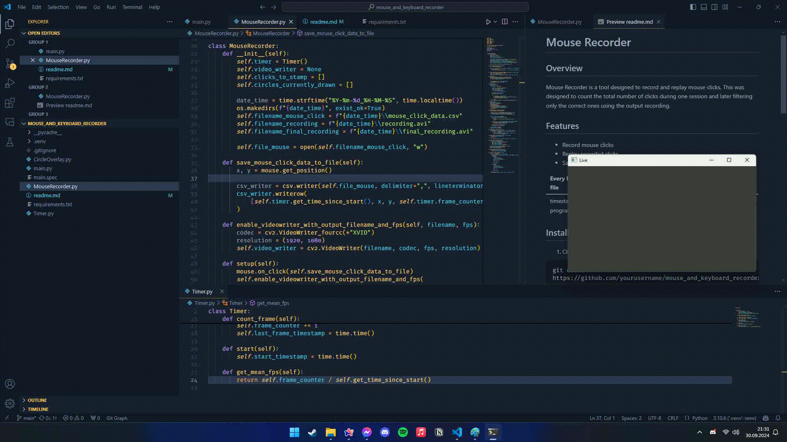

# Mouse Recorder


## Overview
Mouse Recorder is a tool designed to record and replay mouse clicks. This was designed to count the total number of clicks during one session and later filtering only the correct ones using the output recording.




## Features
- Record mouse clicks
- Replay recorded clicks
- Save mouse clicks to `.csv` file with pattern

| Every line in .csv file       |                     |                    |                                    |
| ----------------------------- | ------------------- | ------------------ | ---------------------------------- |
| timestamp since program start | x screen coordinate | yscreen coordinate | which frame the click too place on |

## Installation
1. Clone the repository:
  ```sh
  git clone https://github.com/mmalarski/mouse_and_keyboard_recorder
  ```
2. Navigate to the project directory:
  ```sh
  cd mouse_and_keyboard_recorder
  ```
3. Install the required dependencies:
  ```sh
  pip install -r requirements.txt
  ```

## Usage
1. Run the recorder:
  ```sh
  python main.py
  ```
2. Live preview will appear on screen, this can be minimised
3. When running, press `numpad 1`, `numpad 2`, `numpad 3` or `numpad 4` to make a timestamp when starting a task
4. `numpad 0` makes a STOP timestamp after finishing the task
5. `numpad 8` and `numpad 9` add CORRECT and WRONG timestamps respectively for tasks requiring an answer
6. To end the recording click `backspace`  

Program reads input in the background.

## Build
1. Install pyinstaller
```sh
pip install pyinstaller
```
2. Build the .exe file with following command:
```sh
pyinstaller main.spec
```